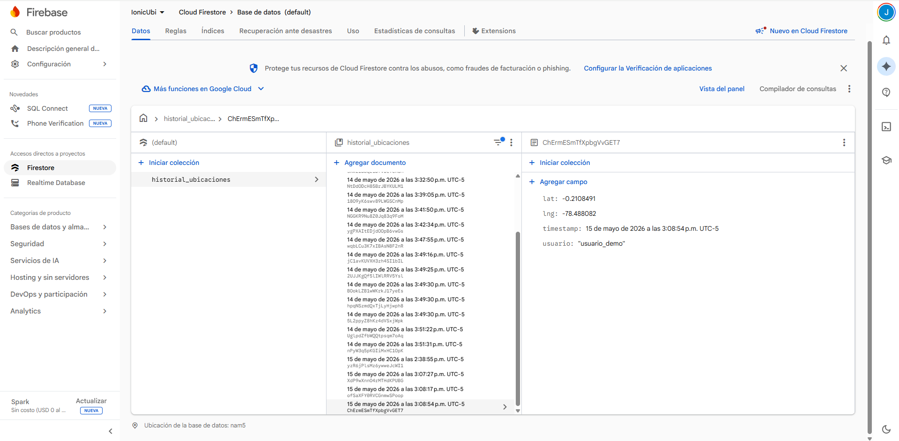
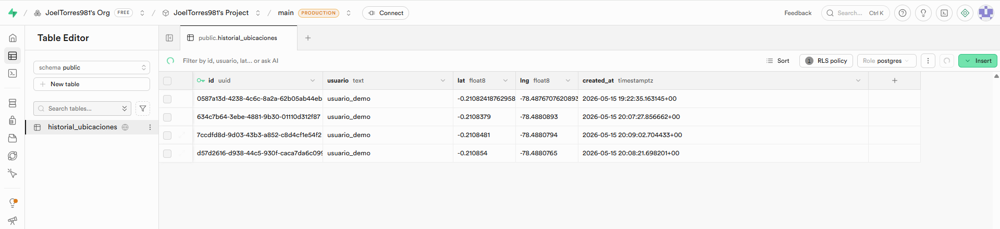

# Monitoreo de Ubicaciones - Ionic App

Este proyecto es una aplicación móvil desarrollada con **Ionic y Angular** que permite registrar y gestionar el historial de ubicaciones de los usuarios. El sistema integra **Supabase** para el almacenamiento de datos mediante políticas de seguridad (RLS), **Firebase / Firestore** para servicios adicionales y **Capacitor** para el despliegue nativo en Android.

---

## 🚀 Requisitos Previos

Antes de comenzar, asegúrate de tener instalado:
* [Node.js](https://nodejs.org/)
* [Ionic CLI](https://ionicframework.com/docs/intro/cli) (`npm install -g @ionic/cli`)
* [Android Studio](https://developer.android.com/studio) (para la generación de la APK)

---

## ⚡ Configuración de Servicios

### 1. Supabase (Base de Datos y Seguridad)

Para la persistencia de datos, se configuró una base de datos PostgreSQL en Supabase.

1. Accede al editor SQL de tu panel de Supabase y ejecuta el siguiente script para crear la tabla de historial y habilitar las políticas de seguridad de fila (RLS):

```sql
-- Creación de la tabla de historial de ubicaciones
create table historial_ubicaciones (
  id uuid default gen_random_uuid() primary key,
  usuario text,
  lat double precision,
  lng double precision,
  created_at timestamp with time zone default timezone('utc'::text, now()) not null
);

-- Configuración de políticas de seguridad (RLS)
create policy "Permitir inserciones" 
on historial_ubicaciones 
for insert 
to public 
with check (true);
```

2. Instala las dependencias necesarias en el proyecto de Ionic:
```bash
npm install @supabase/supabase-js
npm install --save-dev @types/node
```

3. Define las credenciales de Supabase en tus archivos de entorno (`src/environments/environment.ts` y `environment.prod.ts`).

### 2. Firebase & Firestore

Configuración para la integración de los servicios de Firebase:

1. Crea un nuevo proyecto en la consola de Firebase.

2. Añade una App Web para obtener el objeto firebaseConfig.

3. Pega las credenciales obtenidas en tus archivos de entorno environment.ts y environment.prod.ts.

4. Instala las librerías oficiales en tu proyecto:
```bash
npm install firebase @angular/fire
```

5. Inicializa Firebase y Firestore dentro del archivo de configuración principal de la app: `src/app/app.config.ts`.

### 3. Desarrollo e Implementación

La lógica de la aplicación se distribuye en los siguientes módulos y componentes clave:

#### Servicios (location.ts)

1. Se añadió un nuevo método para interactuar y enviar los datos de geolocalización hacia Supabase.

2. Se actualizaron y refactorizaron las funciones existentes para sincronizarse correctamente con el servicio de Firebase.

#### Vista Principal (home.page.ts / home.page.html)

1. Lógica (home.page.ts): Se implementó el método encargado de capturar y enviar los datos del usuario. Se integró el manejo de errores y mensajes de éxito para mejorar la experiencia de usuario (UX).

2. Interfaz (home.page.html): Se diseñó la UI que incluye un botón principal que acciona y procesa el guardado de la ubicación.

#### Plugins Adicionales
Para mejorar la navegación externa y abrir enlaces de manera nativa dentro de la aplicación, se instaló el plugin de Capacitor Browser:
```bash
npm install @capacitor/browser
```

## 📸 Capturas de Pantalla

| Registro en Firebase | Registro en Supabase |
|:---:|:---:|
|  |  |
